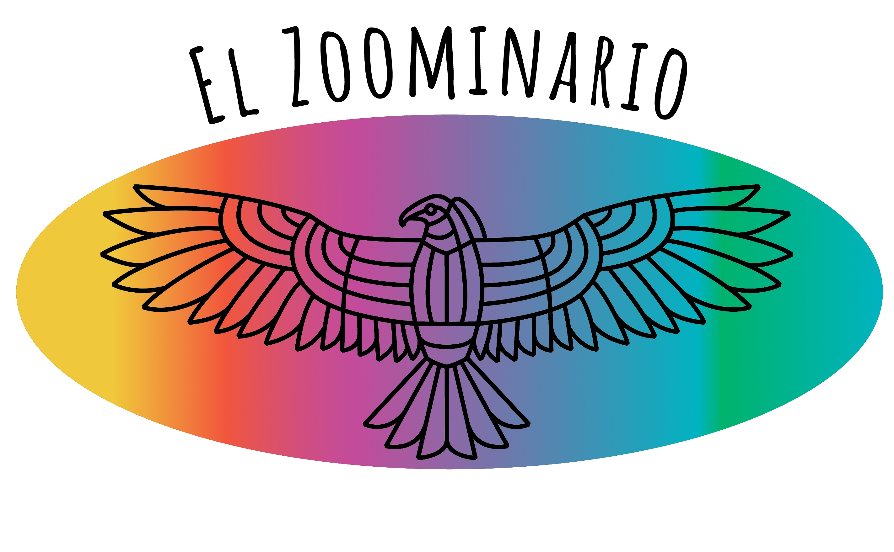

<table class="wide">
<tr>
  <td class="left">
    
  </td>
  <td class="right">

  </td>
</tr>
</table>

Remembering the "Celebrating Latinx voices in STEM" symposium that took place on Thursday Oct 5 2023 (4-7pm CT) and Friday Oct 6 2023 (8-11am CT) in the DeLuca forum in the [Discovery Building](https://goo.gl/maps/AeCdxxd4Qx1BGH9k6).

**Thursday:** [YouTube Recording](https://youtube.com/live/ZBAv9rZC83E?feature=share).

**Friday:** [YouTube Recording](https://youtube.com/live/2xhpUQyQ54I?feature=share).

Stay tuned for 2024!

# Don't miss El Zoominario!

We encourage attendees to also check out other seminar talks by Latinx in [El Zoominario YouTube playlist](https://www.youtube.com/playlist?list=PL1AfUDnwvYbOA9rfrvyA2nR9SR0VYbklx). The list of all El Zoominario speakers can be found in [here](https://solislemuslab.github.io//pages/zoominario.html).

    

# Thanks!

The event could not have been possible without the planning and financial support of:

- [Wisconsin Institute for Discovery](https://wid.wisc.edu/), especially Laura Red Eagle and Patricia Pointer
- [CALS Office of Diversity, Equity and Inclusion](https://admin.cals.wisc.edu/offices/dei/)
- [WISELI](https://wiseli.wisc.edu/)
- [Department of Plant Pathology](https://plantpath.wisc.edu/)

    
    

# Meet the organizer

Originally from Mexico City, Claudia Sol&iacute;s-Lemus is an assistant professor at the [Wisconsin Institute for Discovery](https://wid.wisc.edu/) and the [Department of Plant Pathology](https://plantpath.wisc.edu/) at the [University of Wisconsin-Madison](http://www.wisc.edu). 

    

        

            
        

        

            Pronouns: she/her  
            <a href="https://namedrop.io/claudiasolislemus">Name pronunciation</a> 
            <a href="https://solislemuslab.github.io/">Lab website</a> 
            <a href="https://scholar.google.com/citations?user=GrUypj8AAAAJ&hl=en&oi=ao">Google scholar</a> 
            <a href="https://github.com/crsl4">GitHub</a> 
            <a href="https://solislemuslab.github.io//pages/people.html">Contact Info</a> 
        

    

 

