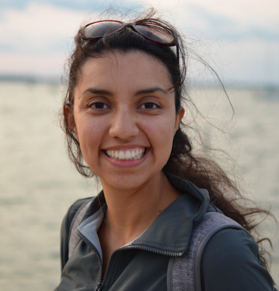
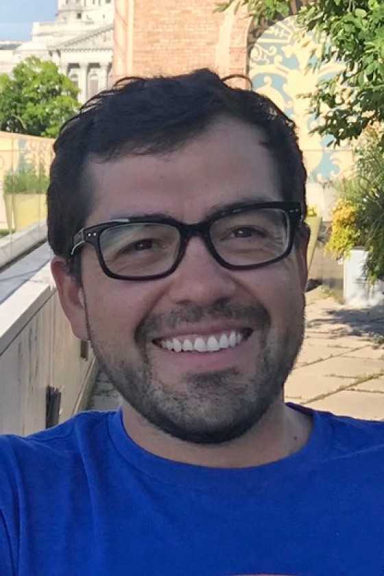

    

### Keynote: Ana Maria Porras

    

        

            
        

        

            Dr. Ana Maria Porras (she/her) is an Assistant Professor of Biomedical Engineering at the University of Florida, where she leads the Tissue-Microbe Interactions lab. Her group engineers models of disease to study human-microbe interactions in the contexts of the gut microbiome, global health, and neglected tropical diseases. She is also a science artist and an expert on inclusive bilingual science communication. Dr. Porras is the co-founder and Senior Advisor of the Latinx in Biomedical Engineering community. She was selected as an IF/THEN AAAS Ambassador for girls and women in STEM and was honored with a statue at the Smithsonian Institution within that program.  Prior to arriving in Florida, Dr. Porras was a Presidential Postdoctoral Fellow at Cornell University. She holds a B.S. in biomedical engineering from the University of Texas at Austin, and a Masters and Ph.D. from the University of Wisconsin-Madison, where she was also an American Heart Association Predoctoral Fellow. When she isn’t doing all that, she loves to read, dance, travel, and, above all, eat ice cream. 
        

    

### Claudia Sol&iacute;s-Lemus

    

        

            
        

        

            Dr. Claudia Solis-Lemus (she/her) is an assistant professor at the [Wisconsin Institute for Discovery](https://wid.wisc.edu/) and the [Department of Plant Pathology](https://plantpath.wisc.edu/) at the [University of Wisconsin-Madison](http://www.wisc.edu). Originally from Mexico City, she did her Undergraduate degrees in Actuarial Sciences and Applied Mathematics at [ITAM](https://www.itam.mx/en). Then, she did a MA in [Mathematics](http://www.math.wisc.edu) and a PhD in [Statistics](http://www.stat.wisc.edu) at the [University of Wisconsin-Madison](http://www.wisc.edu). In her spare time, Claudia enjoys swimming, running, biking, climbing and yoga! 
        

    

### Victor M. Zavala

    

        

            
        

        

            Dr. Victor M. Zavala (he/his) is the Baldovin-DaPra Professor in the Department of Chemical and Biological Engineering at the University of Wisconsin-Madison and a senior computational mathematician in the Mathematics and Computer Science Division at Argonne National Laboratory. He holds a B.Sc. degree from Universidad Iberoamericana and a Ph.D. degree from Carnegie Mellon University, both in chemical engineering. He is on the editorial board of the Journal of Process Control, Mathematical Programming Computation, and Computers & Chemical engineering. He is a recipient of NSF and DOE Early Career awards and of the Presidential Early Career Award for Scientists and Engineers (PECASE). His research interests include statistics, control, and optimization and applications to energy and environmental systems. 
        

    

### Mayra Oyola-Merced

### Angel Adames Corraliza

### Daniel Pimentel-Alarcon

### Laura Hernandez
