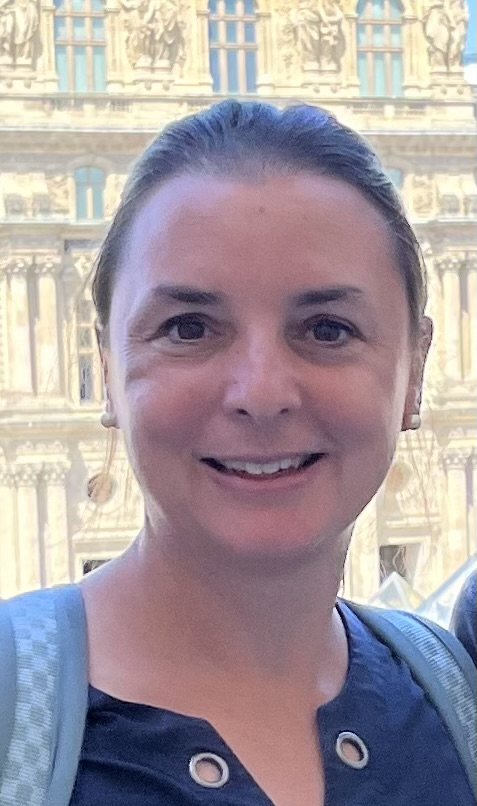

    

### Keynote: Ana Maria Porras

    

        

            
        

        

            Dr. Ana Maria Porras (she/her, <a href="https://namedrop.io/anamariaporras">name pronunciation</a>) is an Assistant Professor of Biomedical Engineering at the University of Florida, where she leads the Tissue-Microbe Interactions lab. Her group engineers models of disease to study human-microbe interactions in the contexts of the gut microbiome, global health, and neglected tropical diseases. She is also a science artist and an expert on inclusive bilingual science communication. Dr. Porras is the co-founder and Senior Advisor of the Latinx in Biomedical Engineering community. She was selected as an IF/THEN AAAS Ambassador for girls and women in STEM and was honored with a statue at the Smithsonian Institution within that program.  Prior to arriving in Florida, Dr. Porras was a Presidential Postdoctoral Fellow at Cornell University. She holds a B.S. in biomedical engineering from the University of Texas at Austin, and a Masters and Ph.D. from the University of Wisconsin-Madison, where she was also an American Heart Association Predoctoral Fellow. When she isn’t doing all that, she loves to read, dance, travel, and, above all, eat ice cream. 
        

    

### Claudia Sol&iacute;s-Lemus

    

        

            
        

        

            Dr. Claudia Solis-Lemus (she/her, <a href="https://namedrop.io/claudiasolislemus">name pronunciation</a>) is an assistant professor at the Wisconsin Institute for Discovery and the Department of Plant Pathology at the University of Wisconsin-Madison. Originally from Mexico City, she did her Undergraduate degrees in Actuarial Sciences and Applied Mathematics at ITAM. Then, she did a MA in Mathematics and a PhD in Statistics at the University of Wisconsin-Madison. In her spare time, Claudia enjoys swimming, running, biking, climbing and yoga! 
        

    

### Victor M. Zavala

    

        

            
        

        

            Dr. Victor M. Zavala (he/his) is the Baldovin-DaPra Professor in the Department of Chemical and Biological Engineering at the University of Wisconsin-Madison and a senior computational mathematician in the Mathematics and Computer Science Division at Argonne National Laboratory. He holds a B.Sc. degree from Universidad Iberoamericana and a Ph.D. degree from Carnegie Mellon University, both in chemical engineering. He is on the editorial board of the Journal of Process Control, Mathematical Programming Computation, and Computers & Chemical engineering. He is a recipient of NSF and DOE Early Career awards and of the Presidential Early Career Award for Scientists and Engineers (PECASE). His research interests include statistics, control, and optimization and applications to energy and environmental systems. 
        

    

### Mayra Oyola-Merced

    

        

            
        

        

            Dr. Mayra Oyola-Merced (she/her) is an Assistant Professor at the Department of Atmospheric and Oceanic Sciences and the University of Wisconsin-Madison. Her research focuses on improving space-borne observation capabilities and how these datasets are used in atmospheric modeling. She was a Scientist at the NASA Jet Propulsion Laboratory and served as the Deputy Director of the International GNSS Service (IGS), where she oversaw a federation of over 250 organizations. She is currently serves in the National Academy of Sciences Committee on Earth Science and Applications from Space, the Board of Representation, Accessibility, Inclusion and Diversity of the American Meteorological Society, among many others.
        

    

### Angel Adames Corraliza

    

        

            
        

        

            Ángel (he/his) grew up in the town of San Sebastian in central-west Puerto Rico. Driven by an interest in understanding the physical world, especially the weather and climate of the island, Ángel studied Physics at the University of Puerto Rico-Mayagüez. He obtained a PhD in Atmospheric Sciences from the University of Washington. Right now, Ángel is an assistant professor in the Department of Atmospheric and Oceanic Sciences at UW-Madison. Besides his work, he likes exercise, good food, procrastination, and a good laugh. 
        

    

### Daniel Pimentel-Alarcon

### Lucia Gutierrez

    

        

            
        

        

            Dr. Gutierrez (she/her) is an Associate Professor and the Cereals Breeder and Quantitative Geneticist at the University of Wisconsin-Madison. Dr. Gutierrez earned her Ph.D. in Plant Breeding from Iowa State University and spent time as a postdoc at the Biometris Unit at Wageningen University and Research Center in the Netherlands. She was an Associate Professor in Statistical Genetics at the Universidad de la Republica in Uruguay before joining UW-Madison. Dr. Gutierrez has a strong international recognition being regularly invited to present her research in quantitative genetics and to teach advanced courses for graduate students, researchers, and plant breeders abroad. Dr. Gutierrez has served professional societies and the academic community in several roles including being Chair of the Plant Breeding and Genetics Division of the Crop Science Society of America, member of the Oat Global Board of Directors, the International Oat Nursery Executive and Genomics Committees, and the Steering Committee of the Agricultural Genomes to Phenomes Initiative, a multimillion USDA initiative to support research connecting high throughput phenotyping with genomic data. Her research focuses on resource optimization for large genomic studies and the understanding of the genetic architecture of complex traits and their response to the environment. She integrates state of the art genotyping technologies with large phenotyping experiments to study complex traits and the mechanisms employed by plants for local adaptation including the study of biotic and abiotic interactions. Her research program has also an applied component, which combines strong theoretical development, genomic tools, and high throughput phenotyping to release oat, wheat, and barley cultivars to serve the U.S. agricultural systems. Dr. Gutierrez has mentored more than 25 graduate students, 25 undergraduate students and served in more than 45 graduate student committees in countries as diverse as the U.S., Uruguay, Argentina, Brazil, Sweden, Australia, Norway, and Canada. Her research career includes the publication of more than 50 papers in high impact journals, securing several million dollars in research funds for her research, and the release of 5 oat cultivars. 
        

    

### Daniel Pimentel-Alarcon

### Laura Hernandez

    

        

            
        

        

            Dr. Laura Hernandez (she/her) is a Professor in the Department of Animal and Dairy Sciences and she has an Affiliate appointment in Obstetrics and Gynecology. She is originally from El Paso, Tx. She did her BS and MS degrees in Animal Sciences at New Mexico State University and her Phd in Nutritional Biochemistry at the University of Arizona. After that she did a Post-Doctoral Fellowship at the University of Cincinnati in Molecular and Cellular Physiology. Fun fact, she was a collegiate swimmer, but now she only runs and does lagree. She loves spending time with two kids (Zoe-12, Max-6) and going to sporting events. 
        

    

### Natalia De Leon Gatti

    

        

            
        

        

            Dr. Natalia De Leon Gatti (she/her) is a professor in the Department of Plant and Agroecosystem Sciences and current chair of the Plant Breeding and Plant Genetics program at the University of Wisconsin, Madison. Her research integrates genomic, phenomic and environmental information to accelerate translational research for enhanced sustainable crop productivity. 
        

    

# Posters

## Ana Maria Vazquez-Catoni (Plant Pathology)

Title: Early Rot of Cranberry: Evaluating grower concerns and Phyllosticta vaccinii presence in vegetatively propagated cuttings

Bio: Ana Maria is a Ph.D. candidate in the department of Plant Pathology at the University of Wisconsin- Madison. She studies how current management of cranberry cuttings impacts pathogen incidence and movement, especially those involved the cranberry fruit rot complex. Her previous research includes addressing grower-oriented questions through the study of tomato and potato plant microbiome with a focus in bacterial endophytes, understanding how biotic and abiotic factors impact plant productivity and product quality and assessing these factors by conducting greenhouse and field studies. When not in the lab, she enjoys cooking, dancing and going to live shows.

## Marcela Tabima Martinez (Regenerative Biology Research Group)

Title: Assessment of Performance of Endothelialized Small Diameter Engineered Vascular Grafts Under Different Shear Stress Conditions

Bio: Marcela first started to study Pulmonary Hypertension after she was awarded a Fulbright Scholarship in conjunction with Colombian Government to join the Vascular Tissue Biomechanics Laboratory housed in the Department of Biomedical Engineering at University of Wisconsin–Madison under the supervision of Dr. Naomi Chesler. Upon completion of her doctoral studies, she joined the Vascular Medicine Institute at the University of Pittsburgh under the supervision of Dr. Mark Gladwin. She came back to Colombia to join the Biomedical Engineering Department at Universidad de los Andes as an Assistant Professor for three years. She is currently an associate scientist at the University of Wisconsin-Madison.
 

