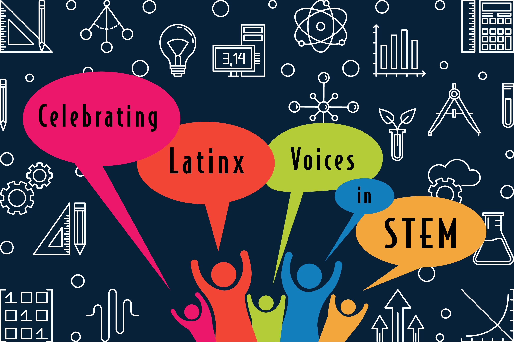

    

The event could not have been possible without the planning and financial support of:

- [Wisconsin Institute for Discovery](https://wid.wisc.edu/), especially Laura Red Eagle and Patricia Pointer
- [CALS Office of Diversity, Equity and Inclusion](https://admin.cals.wisc.edu/offices/dei/)
- [WISELI](https://wiseli.wisc.edu/)
- [Department of Plant Pathology](https://plantpath.wisc.edu/)

    
    

