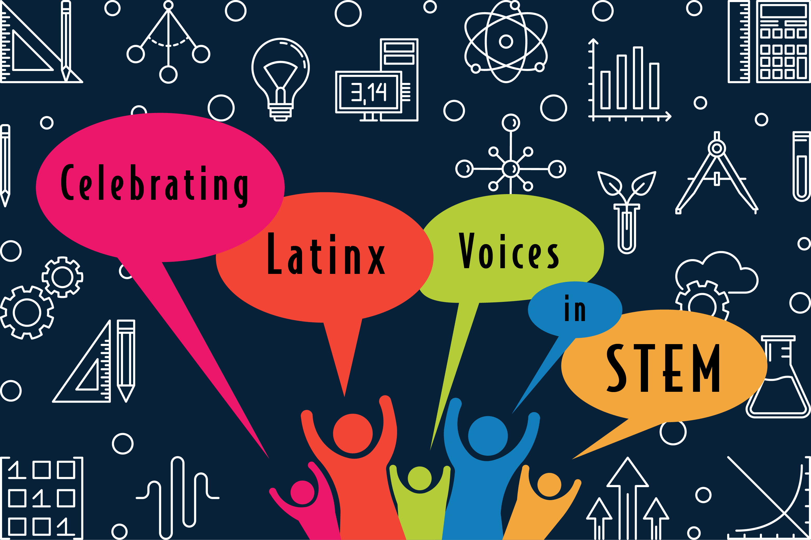
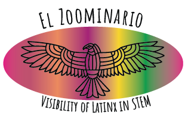

    

The event will be broadcasted live on YouTube in the [Solis-Lemus lab YouTube channel](https://www.youtube.com/channel/UCcBcmxIYYGC6Z04p9SC7hwg/featured).

All videos will be recorded and be publicly available on the YouTube platform.

We encourage attendees to also check out other seminar talks by Latinx in [El Zoominario YouTube playlist](https://www.youtube.com/playlist?list=PL1AfUDnwvYbOA9rfrvyA2nR9SR0VYbklx). The list of all El Zoominario speakers can be found in [here](https://solislemuslab.github.io//pages/zoominario.html).

    

