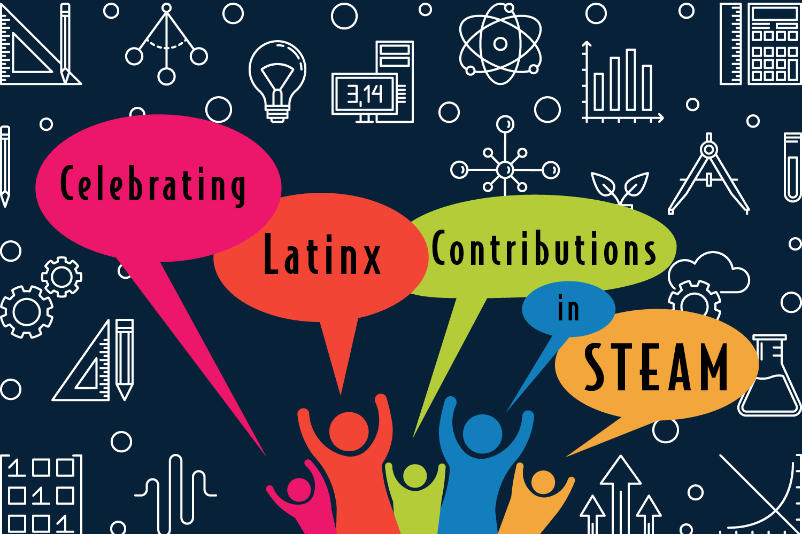

# 2023: Celebrating Latinx voices in STEM!

<table class="wide">
<tr>
  <td class="left">
    
  </td>
  <td class="right">

  </td>
</tr>
</table>

Remembering the "Celebrating Latinx voices in STEM" symposium on Thursday Oct 5 2023 (4-7pm CT) and Friday Oct 6 2023 (8-11am CT) in the DeLuca forum in the [Discovery Building](https://goo.gl/maps/AeCdxxd4Qx1BGH9k6).

**Thursday recording:** [YouTube Live](https://youtube.com/live/ZBAv9rZC83E?feature=share).

**Friday recording:** [YouTube Live](https://youtube.com/live/2xhpUQyQ54I?feature=share).

# Thanks!

The event could not have been possible without the planning and financial support of:

- [Wisconsin Institute for Discovery](https://wid.wisc.edu/), especially Laura Red Eagle and Patricia Pointer
- [CALS Office of Diversity, Equity and Inclusion](https://admin.cals.wisc.edu/offices/dei/)
- [WISELI](https://wiseli.wisc.edu/)
- [Department of Plant Pathology](https://plantpath.wisc.edu/)

    
    

