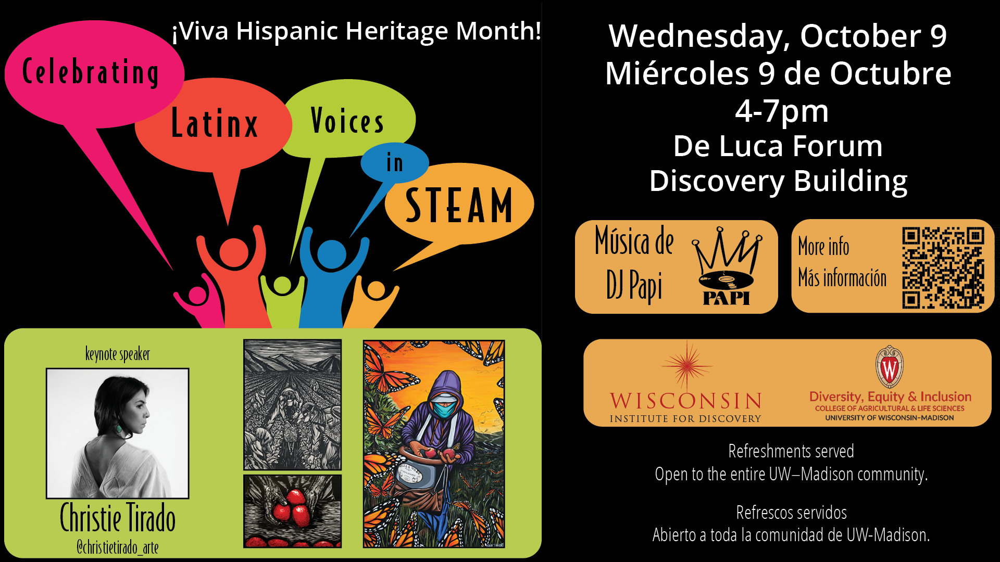

# 2024: Celebrating Latinx voices in STEAM!

<table class="wide">
<tr>
  <td class="left">
    
  </td>
  <td class="right">

  </td>
</tr>
</table>

Join us for the "Celebrating Latinx voices in STEAM" symposium on Wednesday October 9 (4-7pm CT) in the DeLuca forum in the [Discovery Building](https://goo.gl/maps/AeCdxxd4Qx1BGH9k6).

# Don't miss El Zoominario!

We encourage attendees to also check out other seminar talks by Latinx in [El Zoominario YouTube playlist](https://www.youtube.com/playlist?list=PL1AfUDnwvYbOA9rfrvyA2nR9SR0VYbklx). The list of all El Zoominario speakers can be found in [here](https://solislemuslab.github.io//pages/zoominario.html).

    

# Thanks!

The event could not have been possible without the planning and financial support of:

- [Wisconsin Institute for Discovery](https://wid.wisc.edu/), especially Laura Red Eagle and Patricia Pointer
- [CALS Office of Diversity, Equity and Inclusion](https://admin.cals.wisc.edu/offices/dei/)

